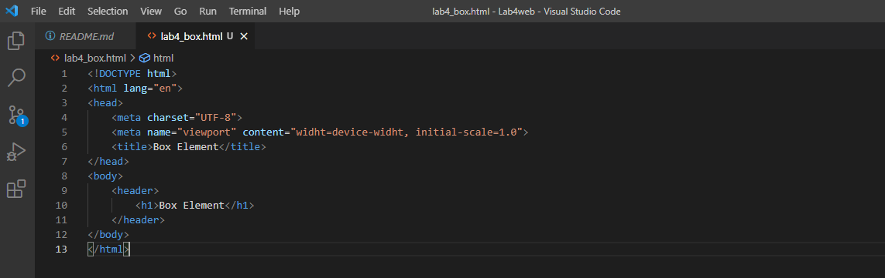
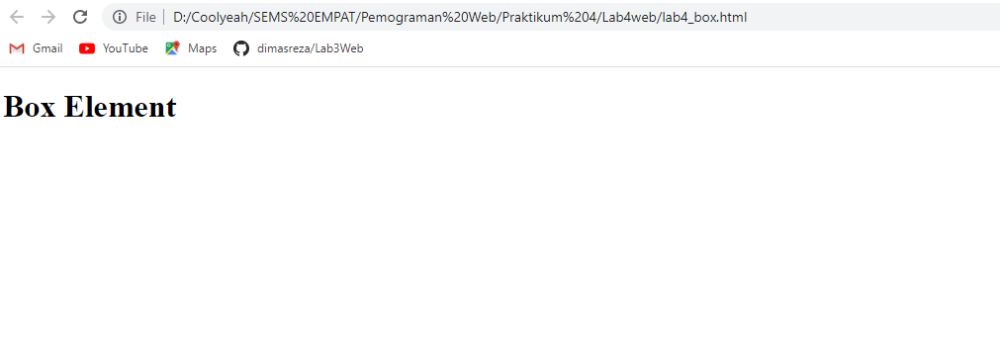

**Praktikum 4**

**Reka Hani Latifah Nurhasanah**

**312010343**

**TI.20.A.2**

**Langkah 1**

**Membuat dokumen HTML**

Membuat dokumen HTML dengan nama file `lab4_box.html` kemudian tambahkan kode untuk membuat box element dengan tag `
` seperti berikut.

maka tampilan akan seperti berikut

