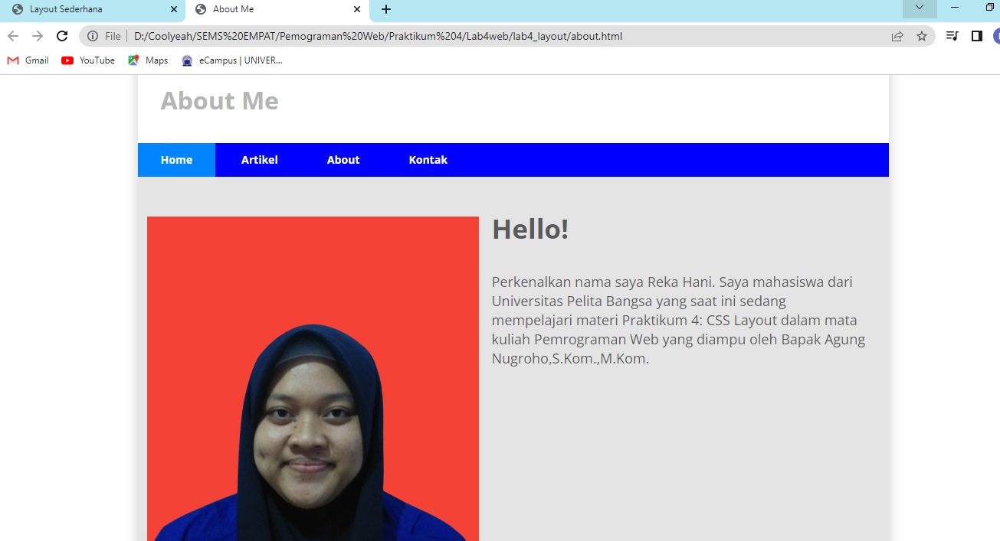

**Praktikum 4**

**Reka Hani Latifah Nurhasanah**

**312010343**

**TI.20.A.2**

**Langkah 1**

**Membuat dokumen HTML**

Membuat dokumen HTML dengan nama file `lab4_box.html` kemudian tambahkan kode untuk membuat box element dengan tag `
` seperti berikut.

maka tampilan akan seperti berikut

**Langkah 2**

**Membuat Box Element**

Menambahkan kode untuk membuat box element dengan tag `div` seperti berikut.

Maka tampilan akan seperti berikut

**Langkah 3**

**Membuat CSS Float Property**

Menambahkan deklarasi CSS pada tag `<head>` untuk membuat *float element*, seperti berikut.

Maka tampilan akan seperti berikut

**Langkah 4**

**Mengatur Clearfix Element**

Menambahkan element pada tag `div` lainnya setelah tag `div3`kemudian mengatur property clear pada CSS, seperti berikut.

Maka tampilan akan seperti berikut

**Langkah 5**

**Mmebuat Layout Sederhana**

Membuat folder baru dengan nama `lab4_layout` kemudian buatlah file baru di dalamnya dengan nama `home.html`, dan file css dengan nama `style.css` kemudian tambahkan kode pada masing-masing file (`home.html` dan `style.css`) seperti berikut.

Maka tampilan dari file `home.html` adalah sebagai berikut

Syntax pada `style.css`

Maka tampilan akan seperti berikut

**Langkah 6**

**Membuat Navigasi**

Mengatur navigasi seperti berikut.

Maka tampilan akan seperti berikut

**Langkah 7**

**Membuat Hero Panel**

Menambahkan kode pada HTML dan CSS seperti berikut.

Maka tampilan akan seperti ini jika kode HTML dan CSS ditambahkan untuk membuat Hero Panel

**Langkah 8**

**Mengatur Layout Main dan Sidebar**

Menambahkan *CSS Float* untuk mengatur *Main Content* dan *sidebar* seperti berikut.

**Langkah 9**

**Membuat Sidebar Widget**

Menambahkan element lain dalam *Sidebar* untuk membuat *Widget* kemudian tambahkan kode CSS untuk mempercantik tampilan sebagai berikut.

Maka tampilan akan seperti berikut

**Langkah 10**

**Mengatur Footer**

Menambahkan kode CSS untuk mengatur tampilan *Footer* seperti berikut.

Maka tampilan akan seperti berikut

**Langkah 11**

**Menambahkan Element lainnya pada Main Content** 

Menambahkan element lainnya pada *Main Content* kemudian tambahkan kode CSS untuk mempercantik tampilan seperti berikut.

Syntax yang dimasukkan pada `style.css`

Maka tampilan akan seperti berikut

**Langkah 12**

**Menambahkan Content Artikel**

Menambahkan kode HTML pada *Main Cnonten* kemudian tambahkan kode CSS 

Maka tampilan akan seperti berikut

## Pertanyaan dan Tugas

1. Tambahkan Layout untuk menu About => buat single layout yang berisi deskripsi, portofolio, dll
2. Tambahkan Layput untuk menu Contact => yang berisi form isian : nama, email, message, dll

#### Jawaban

1. Menambahkan Layout pada menu About
    Membuat dokumen HTML baru dengan nama file `about.html` kemudian menambahkan kode CSS seperti berikut.

    

    
    
    Maka tampilan akan seperti berikut

    

2. Menambahkan Layout pada menu Contact
    Membuat dokumen HTML baru dengan nama file `contact.html` kemudian menambahkan kode CSS seperti berikut.

    

    

    Maka tampilan akan seperti dibawah ini

    